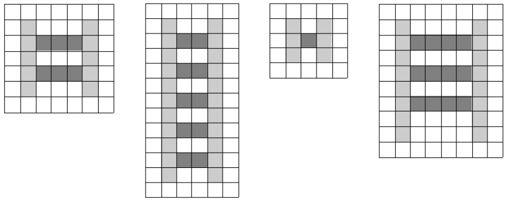

# Simulacro Final 1 - Desconocido - Desconocido

## Ejercicio 1

¿Cuál de los temas teóricos vistos a lo largo de la materia considera de mayor importancia para su formación? ¿Por qué?

## Ejercicio 2

Escribir el código del algoritmo de **búsqueda binaria**.

¿Cuál es la pre condición de este algoritmo?

Justificar.

## Ejercicio 3

Considerando la clase `Feriado`:

```java
public class Feriado {
  public Feriado(String nombre, int dia, int mes) { ... }

  public String obtenerNombre() { ... }

  public int obtenerDia() { ... }

  public int obtenerMes() { ... }
}
```

Implementar el método `indicarDiasFeriadosDelMes` de la clase `BuscadorDeFeriados`.

```java
public class BuscadorDeFeriados {
  /**
   * pos: retorna un arreglo en el que la posición i-ésima indica si el día (i + 1) del mes pasado por parámetro es un feriado o no.
   */
  public boolean[] indicarDiasFeriadosDelMes(Feriado[] feriados, int mes) { ... }
}
```

## Ejercicio 4

Implementar la clase `AgendaSemanal` con las siguientes operaciones:

```java
public class AgendaSemanal {
  public AgendaSemanal(int horaInicio, int horaFin) { ... }

  public void ocupar(int dia, int hora) { ... }

  public boolean estaOcupado(int dia, int hora) { ... }

  public int[] contarHorasOcupadasPorDia() { ...}
}
```

Indicar axiomas de la clase, pre y pos condiciones de las operaciones.

## Ejercicio 5

Implementar el método `dibujarVia` de la clase `Dibujante` para que cumpla con la siguiente interfaz:

```java
public class Dibujante {
  /**
   * pre: 'papel' es un arreglo regular de dimensiones mayor a 5x5.
   * pos: dibuja sobre el papel una vía utilizando los colores indicados para los rieles y los durmientes.
   */
  public void dibujarVia(Color[][] papel, Color colorRieles, Color colorDurmientes) { ... }
}
```


