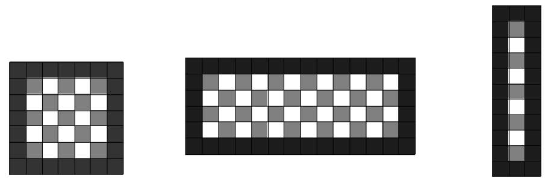

# Simulacro Final 2 - Desconocido - Desconocido

## Ejercicio 1

Escribir el código y explicar el algoritmo de **búsqueda binaria**.

¿Cuál es la precondición de este algoritmo?

Exponer un ejemplo en el que no se cumpla la precondición pero que aún así funcione correctamente.

## Ejercicio 2

Considerando la clase `Paquete`:

```java
public class Paquete {
  public Paquete(int codigo, String remitente, double peso) { ... }

  public int obtenerCodigo() { ... }

  public String obtenerRemitente() { ... }

  public double obtenerPeso() { ... }
}
```

Implementar el método `buscarPesosPorCodigo` de la clase `BuscadorEnPaquetes`.

Agregar las pre y pos condiciones que se crean convenientes.

```java
public class BuscadorEnPaquetes {
  /**
   * pre: ...
   * pos: Retorna un arreglo con los pesos de aquellis Paquetes indicados en 'codigos'.
   */
  public double[] buscarPesosPorCodigo(Paquete[] paquetes, int[] codigos) { ... }
}
```

## Ejercicio 3

Implementar la clase `PlantasVsZombies` con las siguientes operaciones:

```java
public class PlantasVsZombies {
  public PlantasVsZombies(int cantidadDePlantas, int cantidadDeZombies) { ... }

  public void comerPlanta(int numeroDePlanta) { ... }

  public void matarZombie(int numeroDeZombie) { ... }

  public int contarJugadoresFueraDeJuego(Equipo equipo) { ... }

  public int[] obtenerNumerosDeJugadoresEnJuego(Equipo equipo) { ... }

  public boolean terminado() { ... }

  public Equipo obtenerGanador() { ... }
}
```

```java
public enum Equipo {
  PLANTAS,
  ZOMBIES
}
```

Indicar axiomas de la clase, pre y pos condiciones de las operaciones.

## Ejercicio 4

Implementar el método `dibujarTablero` de la clase `Dibujante` para que cumpla con la siguiente interfaz:

```java
public class Dibujante {
  /**
   * pre: papel es un arreglo regular.
   * pos: dibuja sobre el papel un tablero en el que se intercalen posiciones con Color 'claro' y 'oscuro'.
   */
  public void dibujarTablero(Color[][] papel, Color marco, Color claro, Color oscuro) { ... }
}
```

```java
public enum Color {
  BLANCO,
  ROJO,
  AMARILLO,
  AZUL,
  VERDE,
  NARANJA,
  VIOLETA,
  MARRON,
  NEGRO
}
```


