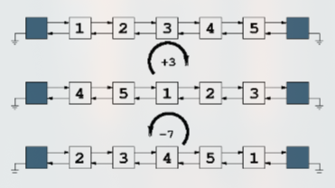

# Primer Parcial - Primer Cuatrimestre - 2025

## Ejercicio 1

Dada la siguiente implementación de _nodos doblemente enlazados_ se pide escribir los métodos `InsertAfter` e `InsertBefore`. Indica el orden de los métodos.

```go
// Estructura de nodo doblemente enlazado.
type Node[T comparable] struct {
  data  T
  next  *Node[T]
  prev  *Node[T]
}

// NewNode crea un nuevo nodo con el dato proporcionado.
func NewNode[T comparable](data T) *Node[T] { ... }

// Data retorna el dato almacenado en el nodo.
func (n *Node[T]) Data() T { ... }

// Next retorna el siguiente nodo en la lista.
func (n *Node[T]) Next() *Node[T] { ... }

// Prev retorna el nodo anterior en la lista.
func (n *Node[T]) Prev() *Node[T] { ... }

// SetData establece un nuevo dato en el nodo.
func (n *Node[T]) SetData(data T) { ... }

// SetNext establece el siguiente nodo en la lista.
func (n *Node[T]) SetNext(next *Node[T]) { ... }

// SetPrev establece el nodo anterior en la lista.
func (n *Node[T]) SetPrev(prev *Node[T]) { ... }

// Remove elimina el nodo actual de la lista.
func (n *Node[T]) Remove() { ... }

// RemoveNext elimina el nodo siguiente al nodo actual.
func (n *Node[T]) RemoveNext() { ... }

// RemovePrev elimina el nodo anterior al nodo actual.
func (n *Node[T]) RemovePrev() { ... }
```

## Ejercicio 2

Dada una _lista doblemente enlazada_, implementada con _nodos centinelas_ y que usa los nodos del ejercicio anterior. Se pide escribir un nuevo método de la lista. Debe ser _O(n)_.

```go
// Rotate permite rotar los elementos de la lista hacia la derecha o izquierda.
// Si el número k es negativo, rota a la izquierda; si es positivo, rota a la derecha.
func (l *List[T]) Rotate(k int) { ... }
```

Implementación de la lista:

```go
type List[T comparable] struct {
  head  *Node[T]
  tail  *Node[T]
  size  int
}

// NewList crea una nueva lista enlazada.
func NewList[T comparable]() *List[T] { ... }

// RemoveFirst elimina el primer nodo de la lista.
func (l *List[T]) RemoveFirst() { ... }

// RemoveLast elimina el último nodo de la lista.
func (l *List[T]) RemoveLast() { ... }

// Remove elimina el nodo con el dato pasado por parámetro.
func (l *List[T]) Remove(data T) { ... }

// IsEmpty retorna true si la lista está vacía.
func (l *List[T]) IsEmpty() bool { ... }

// Size retorna la cantidad de nodos en la lista.
func (l *List[T]) Size() int { ... }

// Head retorna el primer nodo de la lista. El primero después del centinela.
func (l *List[T]) Head() *Node[T] { ... }

// Tail retorna el último nodo de la lista. El anterior al centinela.
func (l *List[T]) Tail() *Node[T] { ... }
```

Por ejemplo, `Rotate(1)` implica tomar el elemento de la cabeza y agregarlo a la cola de la lista. Mientras que `Rotate(-1)` implica tomar el elemento de la cola de la lista y agregarlo a la cabeza. En la siguiente imagen se observan dos rotaciones a derecha y a izquierda.



**Pista**: Se pueden usar los métodos `InsertAfter` e `InsertBefore` del ejercicio anterior.

## Ejercicio 3

Escribir una función recursiva que dibuje un triángulo rectángulo por pantalla usando asteriscos. Donde en la primera línea se imprime 1 asterisco, en la segunda 2, y en la línea n se imprimen n asteriscos.

Por ejemplo, la llamada `DibujarTriangulo(5)` debería generar la siguiente salida:

```sh
*
**
***
****
*****
```

## Ejercicio 4

Supongamos que alguien nos dice que la siguiente función puede encontrar el número más grande de un arreglo en menos de _O(n)_, ya que utiliza la técnica de _división y conquista_. El arreglo está desordenado. Se pide probar o refutar la afirmación aplicando el _Teorema del Maestro_.

```go
func Max(arr []int, start int, end int) int {
  if start == end {
    return arr[start]
  }
  mid := (start + end) / 2
  max := Max(arr, start, mid)
  for i := mid + 1; i <= end; i++ {
    if arr[i] > max {
      max = arr[i]
    }
  }
  return max
}
```
